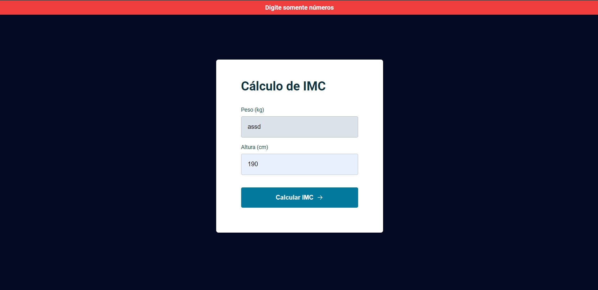

  

  
  
  

  

## 🧪 Tecnologias

Este projeto foi desenvolvido utilizando as seguintes tecnologias:

- HTML
- CSS
- JS

## 📝 Licenças
Este projeto está licenciado sob a Licença MIT. Consulte o arquivo [LICENSE](LICENSE) para obter detalhes.

## 🎨 Inspiração:

https://www.figma.com/file/2dAn3UmPjcz00vfjfOpAIH/IMC-(Copy)

---

Feito com 💜 por [Petersonmatias](pmacielmatias@gmail.com) 👋
