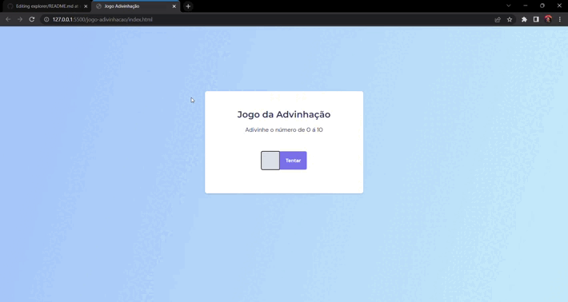

  

  
  
  

  

## 🧪 Tecnologias

O foco do projeto era aprender a manipulação da DOM 

Foi desenvolvido utilizando as seguintes tecnologias:

- HTML
- CSS
- JS

## 📝 Licenças
Este projeto está licenciado sob a Licença MIT. Consulte o arquivo [LICENSE](LICENSE) para obter detalhes.

---

Feito com 💜 por [Petersonmatias](pmacielmatias@gmail.com) 👋

https://github.com/Petersonmatias/explorer/tree/main/explorer-rocketseat/stage05/jogo-adivinhacao
